# AeroEdge-X — Corrected Mermaid Technical Figures (13–25)

---

## FIGURE 13 — AeroEdge-X End-to-End Technician Workflow

```mermaid
flowchart LR
    classDef verified fill:#12C6B3,color:#000000,stroke:#0000B3,stroke-width:1px;
    classDef current fill:#EAF4FF,color:#000000,stroke:#0000B3,stroke-width:1.5px;
    classDef neutral fill:#F5F7FA,color:#000000,stroke:#667085,stroke-width:1px;

    TECH["TECHNICIAN"]:::neutral

    subgraph P1["01 PREPARE"]
        direction TB
        A1["Open AeroEdge-X"]:::current
        A2["Select Aircraft / Component"]:::current
        A3["Configure Inspection"]:::current
        A1 --> A2 --> A3
    end

    subgraph P2["02 CAPTURE"]
        direction TB
        B1["Local Image Upload\n.jpg / .png"]:::current
    end

    subgraph P3["03 INSPECT"]
        direction TB
        C1["YOLOv11\nUltralytics / PyTorch"]:::verified
        C2["Defect Class\nConfidence\nBounding Box\nSeverity"]:::verified
        C1 --> C2
    end

    subgraph P4["04 UNDERSTAND"]
        direction TB
        D1["ChromaDB\nLocal Maintenance Docs"]:::verified
        D2["Phi-3 Mini\nOllama Local Runtime"]:::verified
        D1 --> D2
    end

    subgraph P5["05 RECORD"]
        direction TB
        E1["Technician Review"]:::current
        E2["SQLite\nInspection-State Persistence"]:::verified
        E3["Local Artifacts"]:::current
        E1 --> E2 --> E3
    end

    subgraph P6["06 REPORT"]
        direction TB
        F1["PDF Report\nReportLab"]:::verified
    end

    TECH --> A1
    A3 --> B1
    B1 --> C1
    C2 --> D1
    D2 --> E1
    E3 --> F1
```

---

## FIGURE 14 — AeroEdge-X AI Inspection Pipeline

```mermaid
flowchart LR
    classDef verified fill:#12C6B3,color:#000000,stroke:#0000B3,stroke-width:1px;
    classDef current fill:#EAF4FF,color:#000000,stroke:#0000B3,stroke-width:1.5px;

    subgraph IN["INPUT"]
        I1["Uploaded Image"]:::current
    end

    subgraph VIS["VISION"]
        V1["OpenCV\nPreprocessing"]:::verified
        V2["YOLOv11\nbest.pt"]:::verified
        V3["Detection Evidence\nDefect Class\nConfidence\nBounding Box\nSeverity"]:::verified
        V1 --> V2 --> V3
    end

    subgraph KNO["KNOWLEDGE"]
        K1["Inspection Context\nDefect Type + Severity"]:::current
        K2["ChromaDB\nall-MiniLM-L6-v2\nSimilarity k=3"]:::verified
        K3["Local Maintenance PDFs\nPyMuPDF Ingestion"]:::verified
        K4["Retrieved Evidence\nProcedure / Source / Page"]:::verified
        K3 --> K2
        K1 --> K2
        K2 --> K4
    end

    subgraph REA["REASONING"]
        R1["Phi-3 Mini\nOllama localhost:11434"]:::verified
        R2["Grounded Maintenance Guidance\n5 Repair Steps"]:::verified
        R1 --> R2
    end

    subgraph OUT["OUTPUT"]
        O1["SQLite\nInspection Record"]:::verified
        O2["PDF Report\nReportLab"]:::verified
        O1 --> O2
    end

    I1 --> V1
    V3 --> K1
    K4 --> R1
    R2 --> O1
```

---

## FIGURE 15 — AeroEdge-X Current System Architecture

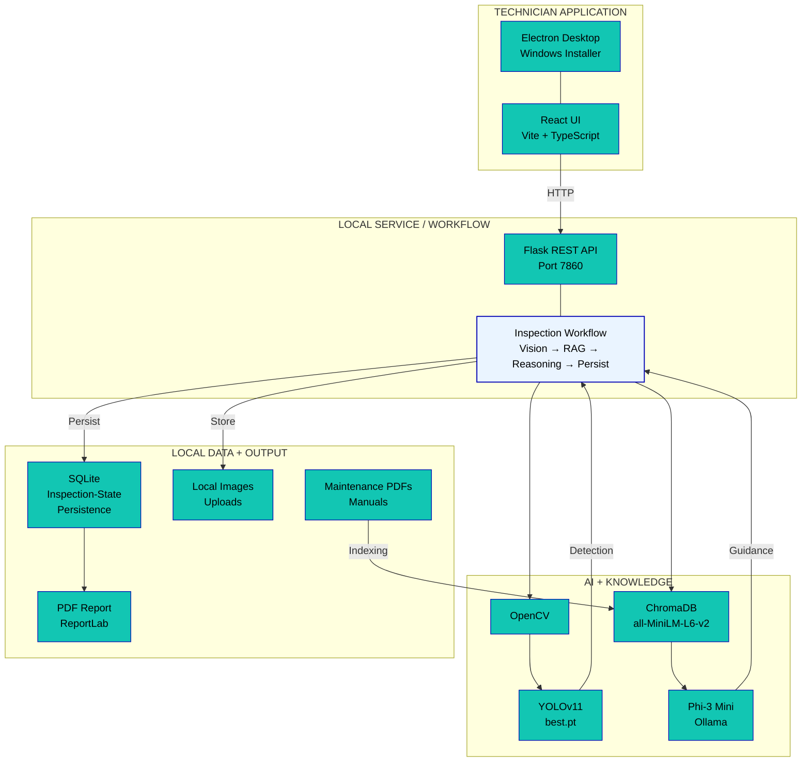

---

## FIGURE 16 — AeroEdge-X Edge + Cloud Evolution

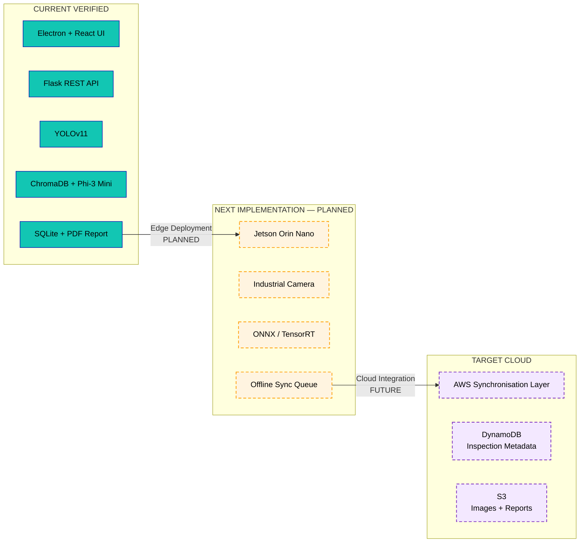

---

## FIGURE 17 — AeroEdge-X Offline-First Synchronization — Target Workflow

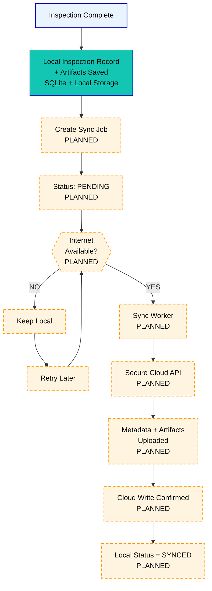

---

## FIGURE 18 — AeroEdge-X Jetson Orin Nano Edge Deployment — Target

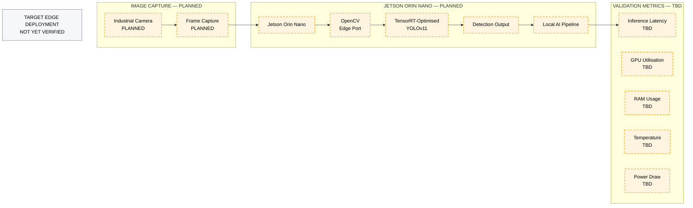

---

## FIGURE 19 — AeroEdge-X AWS Synchronization Architecture — Target

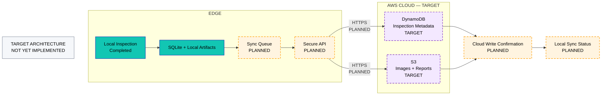

---

## FIGURE 20 — AeroEdge-X Inspection Data Flow

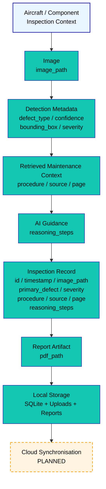

---

## FIGURE 21 — AeroEdge-X Inspection Evidence Traceability

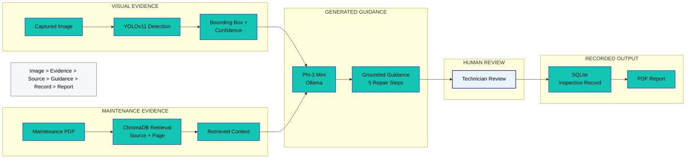

---

## FIGURE 22 — AeroEdge-X Current Status and Roadmap

```mermaid
flowchart LR
    classDef verified fill:#12C6B3,color:#000000,stroke:#0000B3,stroke-width:1px;
    classDef planned fill:#FFF4E0,color:#000000,stroke:#FF9C00,stroke-width:1.5px,stroke-dasharray:6 4;
    classDef future fill:#F3E8FF,color:#000000,stroke:#7B2CBF,stroke-width:1.5px,stroke-dasharray:6 4;

    subgraph M1["M1 — COMPLETED"]
        M1A["Core AI POC\nYOLOv11 / ChromaDB\nPhi-3 Mini / SQLite / PDF"]:::verified
    end

    subgraph M2["M2 — COMPLETED"]
        M2A["Architecture + Desktop\nElectron / React / Flask"]:::verified
    end

    subgraph M3["M3 — NEXT IMPLEMENTATION"]
        M3A["Jetson / Camera\nONNX / TensorRT\nAWS Synchronisation"]:::planned
    end

    subgraph M4["M4 — REMAINING VALIDATION"]
        M4A["End-to-End Integration\nDataset Validation\nLatency Measurement\nResource Profiling\nOffline / Reconnect"]:::planned
    end

    subgraph M5["M5 — STAGE 3 TARGET"]
        M5A["End-to-End Prototype\nJanuary 2027"]:::future
    end

    subgraph M6["M6 — FUTURE SCOPE"]
        M6A["Thermal / Multimodal\nMulti-Camera / Multi-Jetson\nFleet Analytics / Digital Twin\nPredictive Maintenance\nProduction Controls"]:::future
    end

    M1 --> M2 --> M3 --> M4 --> M5 --> M6
```

---

## FIGURE 23 — AeroEdge-X Future Evolution

```mermaid
flowchart LR
    classDef future fill:#F3E8FF,color:#000000,stroke:#7B2CBF,stroke-width:1.5px,stroke-dasharray:6 4;

    subgraph INS["INSPECTION"]
        direction TB
        I1["Real-Time Industrial Camera"]:::future
        I2["Thermal Sensing\nIR Camera"]:::future
        I3["RGB + Thermal\nMultimodal Inspection"]:::future
    end

    subgraph ESC["EDGE SCALE"]
        direction TB
        E1["Multi-Camera\nSingle Jetson"]:::future
        E2["Multi-Jetson\nDistributed Edge"]:::future
    end

    subgraph FLT["FLEET"]
        direction TB
        F1["AWS Fleet Analytics"]:::future
        F2["Fleet Management"]:::future
    end

    subgraph INT["INTELLIGENCE"]
        direction TB
        N1["Advanced Digital Twin"]:::future
        N2["Predictive Maintenance"]:::future
        N3["Technician Feedback"]:::future
        N4["Model Monitoring\nControlled Retraining"]:::future
    end

    subgraph PRD["PRODUCTION CONTROLS"]
        direction TB
        P1["Human Approval\nAudit Trail"]:::future
        P2["RBAC"]:::future
        P3["Secure Device Identity\nEncryption"]:::future
        P4["Versioned Models\nSigned Updates\nRollback / Recovery"]:::future
    end

    INS --> ESC --> FLT --> INT --> PRD
```

---

## FIGURE 24 — AeroEdge-X Prototype Validation Plan

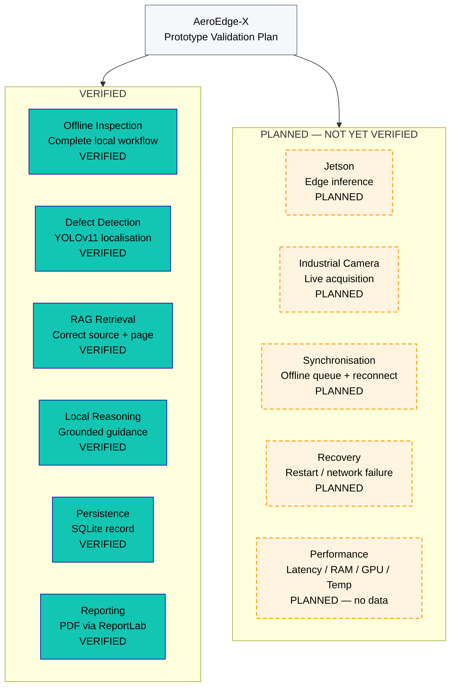

---

## FIGURE 25 — AeroEdge-X Architecture Evolution

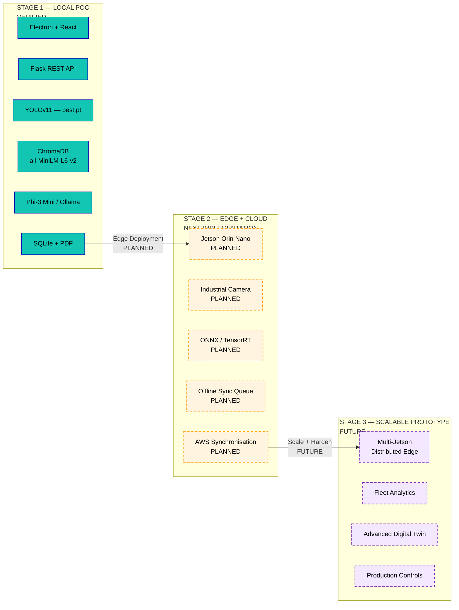
